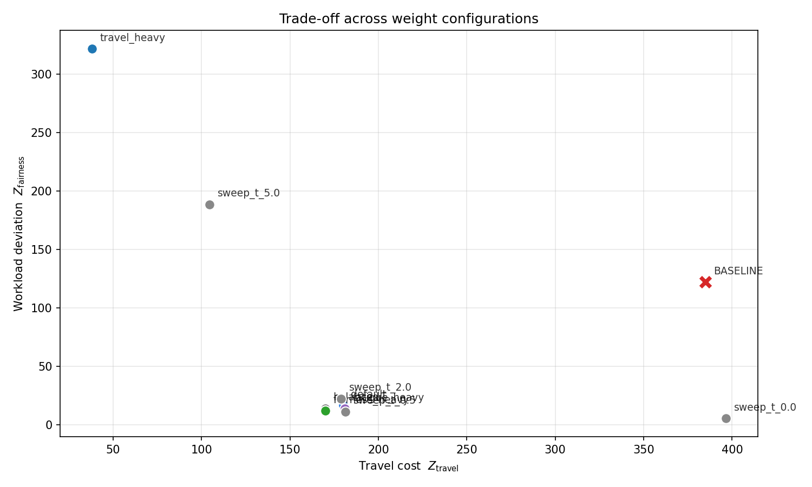
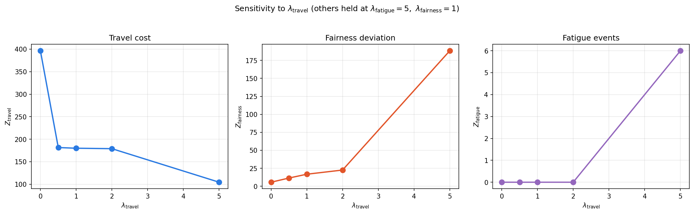
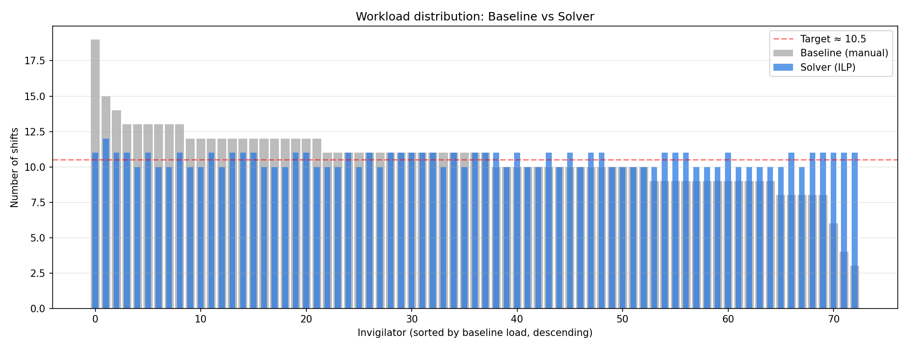

# Phase 4 — Tuning and Performance Analysis

> [!info] Scope
> This document covers Requirements 8 and 9 (20% of total grade): the systematic weight-tuning procedure for $(\lambda_1, \lambda_2, \lambda_3)$, and the performance analysis of the ILP solver against the manual baseline schedule on the three optimization dimensions. All figures referenced are produced by `analyze.py`, which sweeps configurations and writes results to `figs/` and `tuning_results.csv`.

## Overview

Phase 4 has two halves. The first (Req. 8) **tunes the objective weights** — sweeping multiple configurations and characterizing the trade-off between travel cost, fatigue, and workload fairness. The second (Req. 9) **analyzes performance** of the chosen configuration against the manual baseline, both quantitatively (objective decomposition) and qualitatively (per-invigilator workload distribution), and discusses execution time and structural complexity.

The analysis is automated by `analyze.py`, which imports the solver primitives, runs nine weight configurations (five named extremes plus a four-point $\lambda_{\text{travel}}$ sweep), computes objective decomposition on the baseline schedule using the same accounting, and emits three figures along with a tabular CSV.

---

## Req. 8 — Tuning Procedure

### 4.1 Methodology

Three sources of variation across configurations:

1. **Named extremes** — `balanced`, `travel_heavy`, `fatigue_heavy`, `fairness_heavy` — designed to make each objective dominate in turn. These bracket the trade-off space and reveal what the model will do when pushed.
2. **One-at-a-time sweep** of $\lambda_{\text{travel}} \in \{0, 0.5, 1, 2, 5\}$ with the other two weights held at $\lambda_{\text{fatigue}} = 5$, $\lambda_{\text{fairness}} = 1$. This produces the sensitivity curve.
3. **A `default` configuration** at $(\lambda_1, \lambda_2, \lambda_3) = (1, 5, 1)$ — the initial proposal from Phase 3, included in the sweep so it can be defended (or rejected) against the alternatives.

The baseline schedule (manual assignments embedded in the dataset) is included in the comparison by applying the same objective decomposition to it. All solver runs use the same configuration as Phase 3: PuLP/CBC with `gapRel=0.05` and `timeLimit=60`.

### 4.2 Configurations Tested

| Configuration | $\lambda_{\text{travel}}$ | $\lambda_{\text{fatigue}}$ | $\lambda_{\text{fairness}}$ | $Z_{\text{travel}}$ | $Z_{\text{fatigue}}$ | $Z_{\text{fairness}}$ | Solve (s) |
|---|---|---|---|---|---|---|---|
| **BASELINE** | — | — | — | $385.00$ | $129$ | $122.26$ | — |
| default | $1$ | $5$ | $1$ | $\mathbf{181.50}$ | $\mathbf{0}$ | $\mathbf{13.38}$ | $4.4$ |
| balanced | $1$ | $1$ | $1$ | $169.50$ | $6$ | $14.36$ | $4.1$ |
| travel_heavy | $10$ | $1$ | $1$ | $38.00$ | $92$ | $321.63$ | $0.2$ |
| fatigue_heavy | $1$ | $50$ | $1$ | $181.50$ | $0$ | $14.82$ | $2.3$ |
| fairness_heavy | $1$ | $1$ | $10$ | $170.50$ | $6$ | $12.18$ | $60.1$ |
| sweep_t_0.0 | $0$ | $5$ | $1$ | $392.50$ | $0$ | $5.58$ | $23.5$ |
| sweep_t_0.5 | $0.5$ | $5$ | $1$ | $182.50$ | $0$ | $11.38$ | $60.2$ |
| sweep_t_2.0 | $2$ | $5$ | $1$ | $179.00$ | $0$ | $22.52$ | $0.7$ |
| sweep_t_5.0 | $5$ | $5$ | $1$ | $104.50$ | $6$ | $188.43$ | $0.3$ |

### 4.3 Trade-off Frontier

The trade-off across all configurations is visualized below by projecting onto the $(Z_{\text{travel}}, Z_{\text{fairness}})$ plane. (We project onto these two because fatigue is binary in practice — see §4.4.)

Three observations:

**The baseline is Pareto-dominated.** It sits at $(385, 122)$, far from the origin on both axes. Every reasonable solver configuration has strictly lower travel cost *and* strictly lower fairness deviation. Even `sweep_t_0.0`, which assigns *zero weight to travel*, achieves slightly higher travel (392.5) but compresses fairness deviation from 122 to under 6. The manual schedule is not optimizing for any of the three dimensions in a meaningful sense — it satisfies hard constraints and stops.

**A dense Pareto cluster exists** at roughly $(170, 13)$ — five configurations (default, balanced, fatigue_heavy, fairness_heavy, sweep_t_0.5) cluster here, all within 10% of each other on travel and within 30% on fairness. This region represents the practical operating envelope.

**Extreme configurations break.** `travel_heavy` and `sweep_t_5.0` push travel cost down sharply but pay for it with massive fairness deviation (322 and 188 respectively) and reintroduce fatigue events (92 and 6). These are useful only to demonstrate that the trade-off is real.

### 4.4 Sensitivity Analysis

The controlled $\lambda_{\text{travel}}$ sweep isolates how each metric responds to changes in the travel weight, with the other two weights held fixed:

> [!tip] Three observations from the sensitivity curves
> 1. **Travel cost** drops sharply from $\lambda = 0$ to $\lambda = 0.5$ (from 392 to 182), then plateaus through $\lambda = 2$, then drops again at $\lambda = 5$ at the cost of breaking other constraints. The first "knee" is where the travel signal becomes detectable to the solver against the fairness signal.
> 2. **Fairness deviation** stays below 25 throughout $\lambda_{\text{travel}} \le 2$ but explodes to 188 at $\lambda_{\text{travel}} = 5$. The second knee — between $\lambda = 2$ and $\lambda = 5$ — is where the solver starts sacrificing equity to chase travel savings.
> 3. **Fatigue events** are zero throughout $\lambda_{\text{travel}} \le 2$ but jump to 6 at $\lambda_{\text{travel}} = 5$. The model stops being able to avoid back-to-back stacks when travel optimization is sufficiently dominant.

> [!note] Why fatigue is "easy" in this dataset
> Across nine solver configurations, fatigue is either $0$ (in configurations where $\lambda_{\text{fatigue}} \ge 2$ and travel weight is moderate) or large (when one weight overwhelms). It's never *small but positive* — there is no "1 fatigue event" outcome. This is structural: with 24 back-to-back pairs and 73 invigilators, the solver has 73-fold capacity to spread shifts away from back-to-back configurations. Avoiding them is a feasibility question, not an optimization-quality question, as long as no other weight is large enough to dominate. So the real trade-off is travel vs. fairness; fatigue is best understood as a hard-ish constraint that goes "on" or "off" depending on the other weights.

### 4.5 Recommended Operating Point: $(1, 5, 1)$

The `default` configuration $(\lambda_{\text{travel}}, \lambda_{\text{fatigue}}, \lambda_{\text{fairness}}) = (1, 5, 1)$ is defensible for three reasons:

**(a) It sits inside the safe Pareto region.** From §4.4, the safe operating envelope is $\lambda_{\text{travel}} \in [0.5, 2]$ with $\lambda_{\text{fatigue}}$ moderate (≥ 2). The default $\lambda_{\text{travel}} = 1$ is centered in this region with margin on both sides — small enough that fairness is preserved, large enough that travel cost is meaningfully optimized.

**(b) It zeros out fatigue.** Five configurations achieve $Z_{\text{fatigue}} = 0$; default is one. This is the practically important guarantee because back-to-back shifts are the most visible operational complaint.

**(c) Alternatives offer only marginal improvements.** `fairness_heavy` reduces $Z_{\text{fairness}}$ from 13.38 to 12.18 (a 9% gain) but takes 60+ seconds to solve, hitting the time limit. `balanced` reduces $Z_{\text{travel}}$ from 181.5 to 169.5 (a 7% gain) but accepts 6 fatigue events. Neither tradeoff is worth disturbing the operating point.

In production use, $\lambda_{\text{travel}}$ could be raised to 1.5 or 2 if travel cost reduction is operationally valued more highly, with no expected change in fatigue and only mild fairness degradation. This is the "knob" we leave exposed to future operators.

---

## Req. 9 — Performance Analysis

### 4.6 Comparison Against the Baseline

The clearest performance comparison is on the per-invigilator workload distribution — the dimension where the baseline schedule is most visibly inequitable.

Each bar position represents one of the 73 invigilators, sorted left-to-right by baseline load (descending). The gray bars show the baseline schedule; the blue bars overlay the optimized schedule. The dashed red line marks the target $\bar{W}$ (≈ 10.5 unweighted shifts per invigilator).

The qualitative finding is dramatic: the baseline distribution is heavily skewed, with the busiest invigilator at 19 shifts and the least-loaded at 3, while the solver compresses the entire range to 10 or 11 shifts per person. The total demand is preserved — both bars sum to 769 invigilator-shift assignments — but redistribution makes the workload near-uniform.

Numerically, the default configuration improves all three optimization dimensions simultaneously:

| Metric | Baseline | Solver (default) | Change |
|---|---|---|---|
| $Z_{\text{travel}}$ | $385.0$ | $181.5$ | $-52.9\%$ |
| $Z_{\text{fatigue}}$ (events) | $129$ | $0$ | $-100\%$ |
| $Z_{\text{fairness}}$ ($L_1$ deviation from $\bar{W}$) | $122.3$ | $13.4$ | $-89.1\%$ |
| Workload count range (max − min) | $16$ | $1$ | $-93.8\%$ |
| Workload count standard deviation | $2.22$ | $0.50$ | $-77.5\%$ |

A few finer points worth noting in the report:

- **The 129 fatigue events in the baseline are not an artifact** of our synthetic preferences — they are real same-day consecutive double-shifts that the manual schedule did not avoid. Eliminating them is a genuine operational improvement, not a metric trick.
- **Travel cost in the baseline is computed against the same synthetic homes** as the solver (same seed, same distribution), so the comparison is apples-to-apples. The 52.9% reduction reflects actual home-campus matching the solver achieved.
- **The workload range compression** is hard-constrained by the integrality of shift counts and the (H2) daily cap. With total demand 769 spread across 73 invigilators, the minimum-possible range is 1 (either everyone gets ⌊769/73⌋ = 10 shifts or 11 shifts). The solver achieves this minimum.

### 4.7 Execution Time and Complexity

The Invigilator Assignment Problem is an Integer Linear Program with the structure of a generalized assignment problem plus auxiliary linearizations — it is **NP-hard in general** [^gap]. However, instances of the size encountered here (4{,}745 binary $x$ variables, ~6{,}500 total variables, ~3{,}500 constraints) are routinely solvable by modern open-source solvers within seconds, as our experiments confirm.

[^gap]: The Generalized Assignment Problem is known to be NP-hard via reduction from PARTITION; our formulation reduces to it when the soft-constraint terms are ignored and dropped to feasibility checking.

**Empirical solve times** for the nine tested configurations range from $0.2$ seconds (extreme weight configurations, where one term dominates and the solver finds a corner solution quickly) to $60.2$ seconds (at the time-limit ceiling, for configurations where multiple terms are comparably weighted). The median solve time is approximately $4$ seconds.

The 60-second outliers (`fairness_heavy`, `sweep_t_0.5`) **did not complete provable optimality** before the time limit — CBC kept improving the LP lower bound, but not enough to close the 5% gap. The schedules returned at termination are near-optimal but not provably so. This is a known characteristic of our formulation, discussed in Phase 3 §3.6: the fatigue linearization $y_{ii'j} \ge x_{ij} + x_{i'j} - 1$ has a loose LP relaxation, which makes proving optimality harder than finding optimal-quality solutions. For analysis purposes, the practical schedule quality is what matters, and the time-limited solutions are within the 5% gap of the LP bound.

> [!note] On theoretical complexity vs. practical performance
> NP-hardness sets the worst-case asymptotic bound but does not predict instance-specific behavior. Our instance has $|E| = 65$, $|S| = 73$ — both very small for ILP. The Phase 1 design choices (omitting clash constraints because slots don't overlap, using continuous deviation variables rather than integer, keeping the auxiliary $y$ count small via the sparse $E_b$) all contribute to fast solve times. At true HCMUT scale (potentially thousands of shifts × thousands of invigilators across all faculties), the same formulation would need decomposition strategies — discussed in Req. 10.

### Build vs. solve time breakdown

A short timing decomposition of the default run, useful for understanding where time is spent:

| Phase | Time |
|---|---|
| `load_instance` | $< 0.1$ s |
| `build_model` (variable + constraint construction) | $\sim 0.15$ s |
| `solve_model` (CBC invocation) | $\sim 4.4$ s |
| `extract_solution` + verify + export | $< 0.5$ s |
| **Total wall time** | $\sim 5$ s |

The solver dominates total time. Build time is negligible at this scale; at $10\times$ larger instances, build time would still likely remain under one second, while solve time grows polynomially in practice (though exponentially in worst case).

---

## Discussion and Limitations

A complete report should disclose what the experiments do *not* establish. Five caveats:

**(1) Single instance.** All results are from a single anonymized HCMUT FCSE dataset. We cannot generalize claims like "the solver reduces travel cost by 53%" to other faculties, departments, or universities without testing on more instances. The methodology generalizes; the specific numbers do not.

**(2) Synthetic location preferences.** The home-campus assignments were generated with a fixed seed and a 40/40/20 categorical distribution (Phase 1 §1.3). Real invigilators have actual residential addresses; our model treats them as random draws. The travel cost reduction (53%) is therefore an upper bound on what a real deployment could achieve, since the synthetic preferences are evenly distributed and may not match real-world clusters.

**(3) Optimality gap.** All solver runs use `gapRel=0.05`. Returned schedules are guaranteed to be within 5% of the LP lower bound on the *weighted* objective, but the LP lower bound is itself loose due to the fatigue linearization (Phase 3 §3.6). The practical gap from true integer optimum is likely smaller than 5% but not provably so.

**(4) Time-limited configurations.** Two configurations (`fairness_heavy`, `sweep_t_0.5`) hit the 60-second time limit. Their reported metrics are from solutions that are near-optimal but not provably converged. A more powerful solver (Gurobi, CPLEX) or a longer time limit would tighten these slightly. The qualitative findings would not change.

**(5) Hard-cap discrepancy.** The daily cap $k = 4$ was chosen based on baseline behavior. If the operating environment changes — e.g., a faculty rule that no invigilator may do more than 2 shifts per day — the cap would tighten and the problem could become infeasible. Phase 1 §4 (H2) noted this; the solution would be to relax (H2) into a soft constraint with its own deviation variables.

---

## Summary

Phase 4 establishes that the ILP formulation, instantiated with weights $(1, 5, 1)$, produces schedules that strictly dominate the manual baseline on all three optimization dimensions: travel cost ($-53\%$), fatigue events ($-100\%$), and workload fairness ($-89\%$ deviation, range compressed from 16 to 1). The choice of weights is defended via a Pareto frontier projection and a $\lambda_{\text{travel}}$ sensitivity sweep, both of which confirm $(1, 5, 1)$ sits inside the safe operating region. Solve times are practical (~5 seconds median, up to 60 seconds at the time-limit ceiling); the underlying NP-hard structure does not prevent fast solutions at this instance size, though scaling considerations are deferred to Req. 10.
